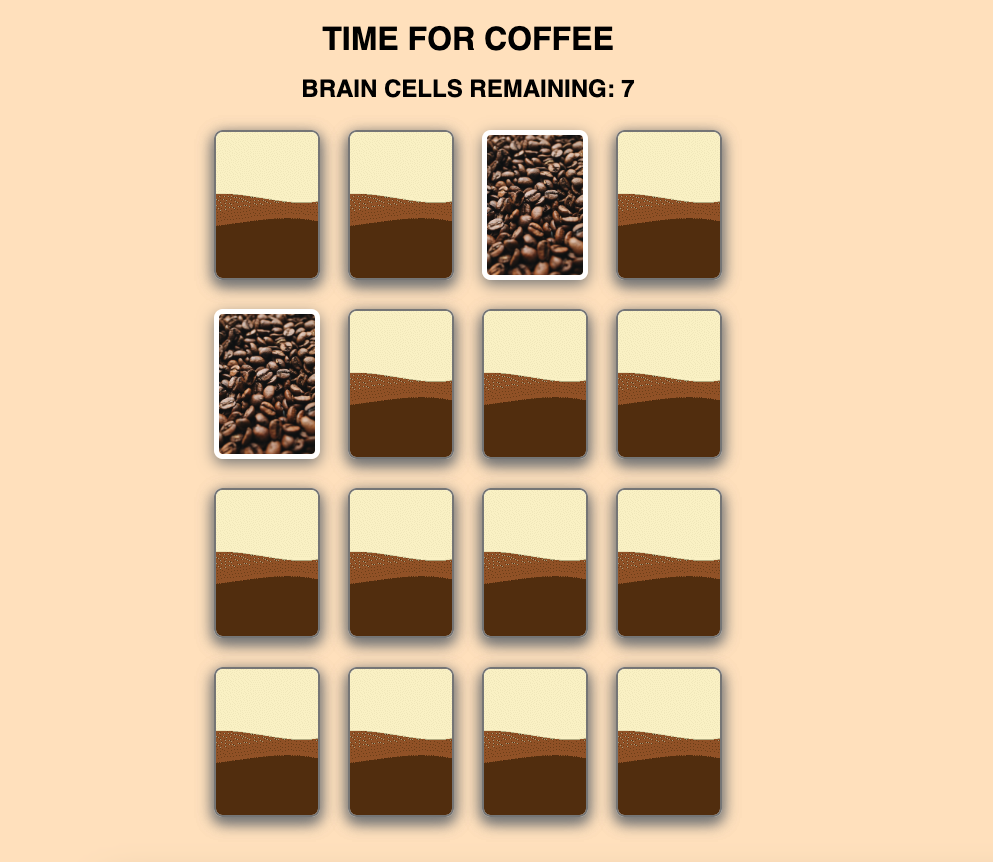
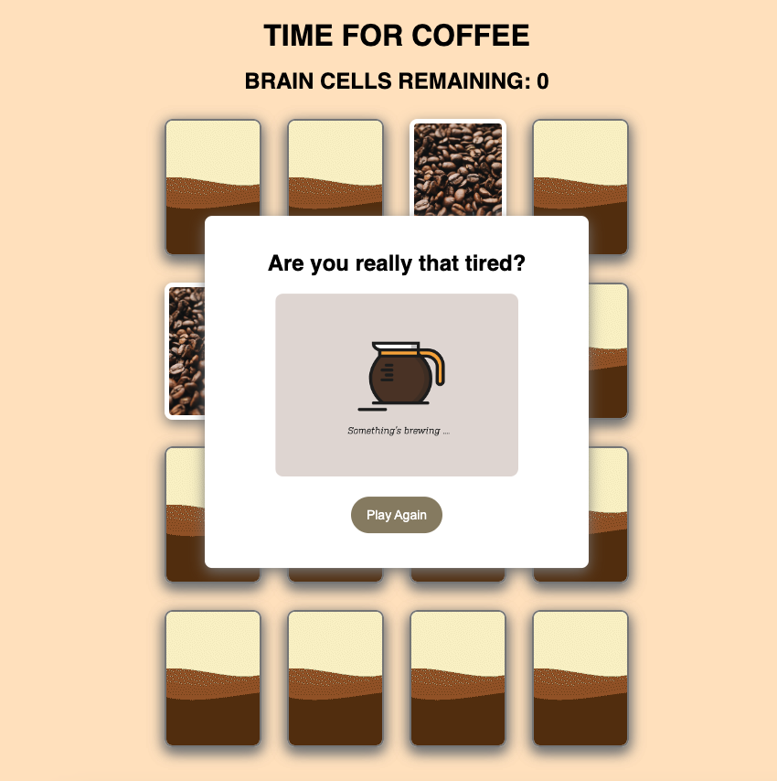

<h1> COFFEE MEMORY GAME </h1>
<h3>Sleep deprived and in need of caffeine?</h3>

Embark on a journey to make your own cup of coffee! Use your remaining 10 brain cells to match each card to receive a virtual boost of energy.

<!-- TABLE OF CONTENTS -->

  
Table of Contents

  <ol>
    <li>
      <a href="#getting-started">Getting Started</a>
    </li>
    <li>
      <a href="#technologies-used">Technologies Used</a></li>
    </li>
    <li>
      <a href="#game-board">Game Board</a>
    </li>
    <li>
      <a href="#next-steps">Next Steps</a>
    </li>
    <li>
      <a href="#acknowledgments">Acknowledgements</a>
    </li>
  </ol>

## Getting Started

After long hours of studying in college, I always looked forward to my morning cup of coffee.
This is a single player matching game. Cards are randomized before the start of each game. Player has 10 tries to find all 8 matches.
<a href="https://dangabrielle.github.io/memory-game/">Click here to start playing!</a>

## Technologies Used

JavaScript, CSS, HTML

## Game Board

 
 

## Next Steps

<ul>
  <li> Implement "Current Score" feature
  <li> Add "Loading" bar to represent number of matches found
  <li> Mobile responsive interface
</ul>

## Acknowledgments

<ul>
  <li> <a href="https://www.webmound.com/shuffle-javascript-array/">Stack Overflow Shuffle Function</a>
</ul>
